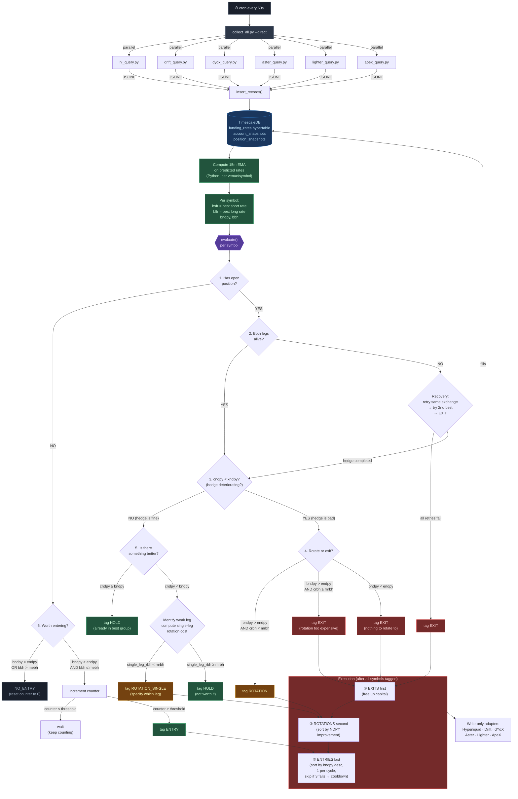

# Hedgehog Engine Spec v1

## Purpose

Allocate capital to the hedge group with the best funding rates. One cycle, one script, one cron job. Every symbol evaluated, tagged, and acted on every 60 seconds.

---

## Pipeline

No daemons. No watcher process. No message queues. One process does everything.



---

## Data Model

### What gets collected every 60s

| Field | Source | Notes |
|-------|--------|-------|
| `settled_rate` | Each venue API | The last epoch's actual rate |
| `predicted_rate` | Each venue API | Continuously updating estimate of next rate |
| `cycle_hours` | Per-market config | 1h for most; 1h/4h/8h for Aster markets; 1h for ApeX |
| `mark_price` | Each venue API | |
| `oracle_price` | Each venue API | |
| `open_interest_usd` | Each venue API | |
| `volume_24h_usd` | Each venue API | |

### What gets computed

**15-minute EMA on predicted rate** — computed in Python after pulling the last ~20 minutes of predicted rate samples from TimescaleDB. This is the single signal used for all decisions.

```python
def compute_ema(rates: list[float], span: int) -> float:
    alpha = 2 / (span + 1)
    ema = rates[0]
    for rate in rates[1:]:
        ema = alpha * rate + (1 - alpha) * ema
    return ema

# span = 15 samples when collecting every 60s = 15-minute EMA
ema_15m = compute_ema(last_15_predicted_rates, span=15)
```

---

## Venue Funding Cycles

| Venue | Cycle | Predicted Rate Updates |
|-------|-------|-----------------------|
| Hyperliquid | 1h | Continuous |
| Lighter | 1h | Continuous |
| Drift | 1h | Continuous |
| dYdX | 1h | Continuous |
| ApeX | 1h | Continuous |
| Aster | 1h / 4h / 8h (per market) | Continuous |

---

## Key Calculations

All derived from the 15m EMA of predicted rates.

### Best rates per symbol

```
bsfr = best short funding rate (highest EMA across all venues for this symbol)
blfr = best long funding rate (lowest EMA across all venues for this symbol)
```

### DPY (daily % yield)

```
short_dpy = bsfr × (24 / short_venue_cycle_hours)
long_dpy  = blfr × (24 / long_venue_cycle_hours)
gross_dpy = short_dpy - long_dpy
```

Note: short_dpy is positive (you collect), long_dpy is the cost (you pay). If long rate is negative (you get paid on both sides), gross_dpy = short_dpy + abs(long_dpy).

### NDPY (net daily % yield)

```
entry_fee  = short_venue_taker_fee_bps/10000 + long_venue_taker_fee_bps/10000
exit_fee   = same (symmetric)
round_trip = entry_fee + exit_fee

ndpy = gross_dpy
```

NDPY is gross_dpy — fees are NOT subtracted from the daily yield. Fees are a one-time fixed cost, not a daily drag. They show up in breakeven hours instead.

### Breakeven Hours

```
breakeven_hours = round_trip_fee / (gross_dpy / 24)
```

"How many hours of funding does it take to pay back the cost of entering and exiting this hedge?"

### APY / MPY / DPY

```
dpy = ndpy
mpy = ndpy × 30
apy = ndpy × 365
```

Simple scaling for display. The decision engine uses DPY and breakeven hours only.

---

## Environment Variables

```bash
# Thresholds (yield values are decimals representing percentages)
ENTRY_NDPY=0.0008          # min NDPY to consider entry
ENTRY_BREAKEVEN=12         # max breakeven hours for entry

ROTATION_BREAKEVEN=6       # max breakeven hours for rotation

EXIT_NDPY=0.0003           # NDPY below this triggers exit evaluation

# Sizing
BASE_SIZE_USD=200           # minimum position size per leg
MAX_POSITION_PCT=0.20       # max 20% of NAV per hedge group
MAX_LEVERAGE=5              # max leverage per leg

# Execution
TAG_THRESHOLD=3             # consecutive cycles a symbol must qualify before execution
ENTRY_FAIL_COOLDOWN=10      # cycles to skip a symbol after 3 consecutive entry failures
MAX_ENTRIES_PER_CYCLE=1     # only 1 new entry per cycle

# Pipeline
COLLECT_INTERVAL=60         # seconds between collection cycles
EMA_SPAN=15                 # number of samples for EMA (15 × 60s = 15 min)
```

---

## Engine Variables

```
bsfr    = best short funding rate (15m EMA) for symbol
blfr    = best long funding rate (15m EMA) for symbol
bndpy   = best possible hedge group net DPY
cndpy   = current hedge group net DPY (from actual position venues)
endpy   = ENTRY_NDPY from .env
xndpy   = EXIT_NDPY from .env
mebh    = ENTRY_BREAKEVEN from .env (max entry breakeven hours)
mrbh    = ROTATION_BREAKEVEN from .env (max rotation breakeven hours)
bbh     = best breakeven hours for this symbol
crbh    = rotation breakeven hours (cost to rotate / improvement per hour)
```

---

## Engine (per symbol, every cycle)

```
1. HAS OPEN POSITION?
   NO  → go to 6
   YES → go to 2

2. IS POSITION HEDGED? (both legs alive)
   YES → go to 3
   NO  → RECOVERY
     if entry_failure (hedge was never completed):
       attempt hedge on same exchange
       if fail → attempt 2nd best exchange (if bndpy > endpy)
       if fail → tag EXIT
     if leg_died (was hedged, one leg closed/liquidated):
       tag EXIT immediately

3. IS CURRENT HEDGE BAD? (cndpy < xndpy)
   NO  → go to 5 (hedge is fine, check for better)
   YES → go to 4 (hedge is deteriorating)

4. HEDGE IS BAD — ROTATE OR EXIT?
   4a. bndpy > endpy AND crbh < mrbh → tag ROTATION
   4b. bndpy > endpy AND crbh ≥ mrbh → tag EXIT (rotation too expensive, cheaper to exit clean)
   4c. bndpy < endpy                  → tag EXIT (nothing worth rotating to)

5. HEDGE IS FINE — IS THERE BETTER?
   5a. cndpy ≥ bndpy → tag HOLD (already in the best group)
   5b. cndpy < bndpy → identify weak leg
       compute single-leg rotation:
         rotation_cost = weak_leg_exit_fee + new_leg_entry_fee
         new_ndpy = (kept_leg_rate + new_leg_rate) → compute DPY
         single_leg_rbh = rotation_cost / ((new_ndpy - cndpy) / 24)
       5b-i.  single_leg_rbh < mrbh → tag ROTATION_SINGLE (specify which leg)
       5b-ii. single_leg_rbh ≥ mrbh → tag HOLD

6. NO POSITION — WORTH ENTERING?
   6a. bndpy < endpy OR bbh > mebh → NO_ENTRY (reset tag counter to 0)
   6b. bndpy ≥ endpy AND bbh ≤ mebh → increment tag counter
   6c. tag counter ≥ TAG_THRESHOLD → eligible for ENTRY
```

**Tag counter rule:** any cycle where a symbol fails its threshold resets the counter to 0. "Consecutive" means consecutive. This works alongside the EMA — the EMA smooths the rate, the counter confirms the EMA isn't just barely crossing the threshold once.

---

## Execution Order

After all symbols are evaluated:

```
1. EXITS first (free up capital)
   - Execute all EXIT tags immediately
   - No ordering needed

2. ROTATIONS second
   - Sort by NDPY improvement descending
   - Execute ROTATION_SINGLE tags (only the weak leg moves)
   - Execute full ROTATION tags

3. ENTRIES last (use freed capital)
   - Sort eligible entries by bndpy descending
   - For each candidate:
       if entry_fail_count ≥ 3 → skip (cooldown), try next
       attempt entry
       if success → stop (MAX_ENTRIES_PER_CYCLE = 1)
       if fail → increment fail counter, try next
   - Failed symbols cool down for ENTRY_FAIL_COOLDOWN cycles then re-enter the queue
```

---

## Sizing

```
target_size = BASE_SIZE_USD × (bndpy / endpy)

capped by:
  - MAX_POSITION_PCT × total_nav
  - available capital on both venue legs
  - MAX_LEVERAGE constraint (target_size / margin ≤ MAX_LEVERAGE)

take the minimum of all caps
```

Example: endpy = 0.0008, bndpy = 0.0024 (3× minimum)
- target_size = $200 × 3 = $600
- NAV = $3000, 20% cap = $600 ✓
- available on both venues = $800 ✓
- margin = $120 at 5× leverage = $600 ✓
- final size = $600

Resizing happens separately from rotation. Rotate first, then resize in a future cycle if the new NDPY justifies a larger position.

---

## SQL Views

```sql
-- Raw data: funding_rates hypertable (collected every 60s)
-- Includes: settled_rate, predicted_rate, venue, symbol, cycle_hours

-- EMA is computed in Python, not SQL
-- Python pulls last 20 min of predicted_rate samples, computes EMA
-- Result is the "rate" used for all calculations below

-- Best rates per symbol (computed in Python from EMA values)
-- bsfr = max(ema) across venues for symbol
-- blfr = min(ema) across venues for symbol

-- Spread matrix and opportunities: computed in Python alongside EMA
-- No need for SQL views that duplicate Python logic

-- What SQL still handles:
--   funding_rates_hourly  (continuous aggregate, for historical charts)
--   latest_positions      (current open positions across venues)
--   latest_accounts       (current balances per venue)
--   portfolio_summary     (aggregate NAV)
--   venue_exposure        (% of NAV per venue, for risk caps)
```

---

## What Doesn't Exist

- No separate watcher daemon
- No pending_actions table (until SEMI_AUTO mode is needed)
- No LangGraph / agent orchestrator
- No Python VenueScorer class (replaced by EMA + NDPY math inline)
- No separate ingest.py CLI script (it's a function imported by collect_all.py)
- No tag counter persistence in DB (in-memory dict, resets on restart — that's fine, worst case you wait TAG_THRESHOLD cycles to re-enter)

---

## File Layout

```
scripts/
  collect_all.py          # entry point, cron runs this
  hl_query.py             # venue script (skill + --json mode)
  drift_query.py
  dydx_query.py
  aster_query.py
  lighter_query.py
  apex_query.py
  lib/
    ingest.py             # insert_records() function, imported by collect_all.py
    ema.py                # compute_ema() and rate math
    engine.py             # the decision engine above
    sizing.py             # position sizing logic
    executor.py           # executes tags via write-only adapters
```
