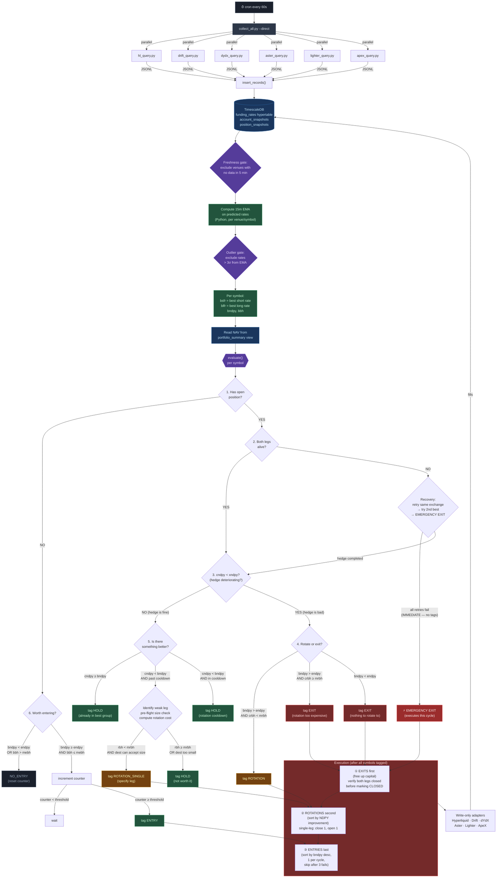

# Hedgehog Engine Spec v2

## Purpose

Allocate capital to the hedge group with the best funding rates. One cycle, one script, one cron job. Every symbol evaluated, tagged, and acted on every 60 seconds.

---

## Pipeline

No daemons. No watcher process. No message queues. One process does everything.



---

## Data Model

### What gets collected every 60s

| Field | Source | Notes |
|-------|--------|-------|
| `settled_rate` | Each venue API | The last epoch's actual rate |
| `predicted_rate` | Each venue API | Continuously updating estimate of next rate |
| `cycle_hours` | Per-market config | 1h for most; 1h/4h/8h for Aster markets; 1h for ApeX |
| `mark_price` | Each venue API | |
| `oracle_price` | Each venue API | |
| `open_interest_usd` | Each venue API | |
| `volume_24h_usd` | Each venue API | |

### Signal computation

**15-minute EMA on predicted rate** — computed in Python after pulling the last ~20 minutes of predicted rate samples from TimescaleDB. This is the single signal used for all decisions.

```python
def compute_ema(rates: list[float], span: int) -> float:
    alpha = 2 / (span + 1)
    ema = rates[0]
    for rate in rates[1:]:
        ema = alpha * rate + (1 - alpha) * ema
    return ema

# span = 15 samples when collecting every 60s = 15-minute EMA
ema_15m = compute_ema(last_15_predicted_rates, span=15)
```

### Data quality gates

Two gates run before any EMA is used for decisions:

**Freshness gate:** If a venue's most recent sample is older than 5 minutes, exclude that venue from this cycle's evaluation entirely. The venue is either down or lagging — don't make decisions on stale data.

```python
STALE_THRESHOLD_SEC = 300  # 5 minutes

def is_fresh(venue: str, symbol: str) -> bool:
    latest_ts = get_latest_timestamp(venue, symbol)  # from DB
    age = (now_utc() - latest_ts).total_seconds()
    return age <= STALE_THRESHOLD_SEC
```

**Outlier gate:** If a venue's current predicted rate is more than 3 standard deviations from its own 15m EMA, exclude that single data point from this cycle. This catches flash spikes from low liquidity, oracle glitches, or manipulation without excluding the venue permanently.

```python
def is_outlier(current_rate: float, ema: float, recent_rates: list[float]) -> bool:
    if len(recent_rates) < 5:
        return False  # not enough data to judge
    std = statistics.stdev(recent_rates)
    if std == 0:
        return False
    z_score = abs(current_rate - ema) / std
    return z_score > 3.0
```

---

## Venue Funding Cycles

| Venue | Cycle | Predicted Rate Updates |
|-------|-------|-----------------------|
| Hyperliquid | 1h | Continuous |
| Lighter | 1h | Continuous |
| Drift | 1h | Continuous |
| dYdX | 1h | Continuous |
| ApeX | 1h | Continuous |
| Aster | 1h / 4h / 8h (per market) | Continuous |

---

## Position Status

Every tracked position has a status. Three states only:

```
ACTIVE    — both legs alive, hedge is functioning
DEGRADED  — one leg failed/closed, or exit partially failed (naked exposure)
CLOSED    — both legs confirmed closed, position record archived
```

Rules:
- A position is only marked CLOSED after both legs are verified closed on-chain / via API
- If an exit attempt closes one leg but the other fails, status becomes DEGRADED (not CLOSED)
- DEGRADED positions get emergency exit treatment on the next cycle (no tag counter, immediate execution)
- On restart, any position not explicitly CLOSED is assumed ACTIVE or DEGRADED and must be re-evaluated

---

## Key Calculations

All derived from the 15m EMA of predicted rates, after freshness and outlier gates.

### NAV

Read from `portfolio_summary` SQL view every cycle. This view aggregates `latest_accounts` across all venues. NAV is never hardcoded or cached — it reflects the most recent account snapshot from each venue.

```python
nav = db.query("SELECT total_nav FROM portfolio_summary").scalar()
```

### Best rates per symbol

```
bsfr = best short funding rate (highest EMA across all fresh, non-outlier venues for this symbol)
blfr = best long funding rate (lowest EMA across all fresh, non-outlier venues for this symbol)
```

### DPY (daily % yield)

```
short_dpy = bsfr × (24 / short_venue_cycle_hours)
long_dpy  = blfr × (24 / long_venue_cycle_hours)
gross_dpy = short_dpy - long_dpy
```

Note: short_dpy is positive (you collect), long_dpy is the cost (you pay). If long rate is negative (you get paid on both sides), gross_dpy = short_dpy + abs(long_dpy).

### NDPY (net daily % yield)

```
ndpy = gross_dpy
```

NDPY is gross_dpy — fees are NOT subtracted from the daily yield. Fees are a one-time fixed cost, not a daily drag. They show up in breakeven hours instead.

### Breakeven Hours

```
entry_fee  = short_venue_taker_fee_bps/10000 + long_venue_taker_fee_bps/10000
exit_fee   = same (symmetric)
round_trip = entry_fee + exit_fee

breakeven_hours = round_trip / (gross_dpy / 24)
```

"How many hours of funding does it take to pay back the cost of entering and exiting this hedge?"

### Rotation Breakeven Hours (single-leg)

```
rotation_cost = old_leg_exit_fee + new_leg_entry_fee  (one round-trip, one leg)
ndpy_improvement = new_ndpy - current_ndpy
rotation_breakeven_hours = rotation_cost / (ndpy_improvement / 24)
```

### APY / MPY / DPY

```
dpy = ndpy
mpy = ndpy × 30
apy = ndpy × 365
```

Simple scaling for display. The decision engine uses DPY and breakeven hours only.

---

## Environment Variables

```bash
# Thresholds (yield values are decimals representing percentages)
ENTRY_NDPY=0.0008          # min NDPY to consider entry
ENTRY_BREAKEVEN=12         # max breakeven hours for entry

ROTATION_BREAKEVEN=6       # max breakeven hours for rotation

EXIT_NDPY=0.0003           # NDPY below this triggers exit evaluation

# Sizing
BASE_SIZE_USD=200           # minimum position size per leg
MAX_POSITION_PCT=0.20       # max 20% of NAV per hedge group
MAX_LEVERAGE=5              # max leverage per leg (applied per-leg, not portfolio-wide)

# Execution
TAG_THRESHOLD=3             # consecutive cycles a symbol must qualify before execution
ENTRY_FAIL_COOLDOWN=10      # cycles to skip a symbol after 3 consecutive entry failures
MAX_ENTRIES_PER_CYCLE=1     # only 1 new entry per cycle
ROTATION_COOLDOWN=60        # min cycles between rotations on same position (60 × 60s = 1 hour)

# Data quality
COLLECT_INTERVAL=60         # seconds between collection cycles
EMA_SPAN=15                 # number of samples for EMA (15 × 60s = 15 min)
STALE_THRESHOLD_SEC=300     # exclude venue if no data in this many seconds
OUTLIER_Z_SCORE=3.0         # exclude rate if z-score exceeds this
```

---

## Engine Variables

```
bsfr    = best short funding rate (15m EMA) for symbol
blfr    = best long funding rate (15m EMA) for symbol
bndpy   = best possible hedge group net DPY
cndpy   = current hedge group net DPY (from actual position venues)
endpy   = ENTRY_NDPY from .env
xndpy   = EXIT_NDPY from .env
mebh    = ENTRY_BREAKEVEN from .env (max entry breakeven hours)
mrbh    = ROTATION_BREAKEVEN from .env (max rotation breakeven hours)
bbh     = best breakeven hours for this symbol
crbh    = rotation breakeven hours (cost to rotate / improvement per hour)
```

---

## Engine (per symbol, every cycle)

### Action classification

Actions are either **confirmed** (require TAG_THRESHOLD consecutive qualifying cycles) or **immediate** (execute same cycle, no counter needed).

```
CONFIRMED actions:  ENTRY
IMMEDIATE actions:  EXIT (all types), ROTATION, ROTATION_SINGLE, EMERGENCY EXIT
```

Emergency exits and all exits from DEGRADED positions never wait for tags. This prevents accumulating naked directional exposure while a counter ticks up.

### Decision tree

```
1. HAS OPEN POSITION?
   NO  → go to 6
   YES → go to 2

2. IS POSITION HEDGED? (both legs alive, status = ACTIVE)
   YES → go to 3
   NO  → position is DEGRADED — RECOVERY (immediate, no tags)
     if entry_failure (hedge was never completed):
       attempt hedge on same exchange
       if fail → attempt 2nd best exchange (if bndpy > endpy)
       if fail → EMERGENCY EXIT (execute this cycle)
     if leg_died (was hedged, one leg closed/liquidated):
       EMERGENCY EXIT (execute this cycle)

3. IS CURRENT HEDGE BAD? (cndpy < xndpy)
   NO  → go to 5 (hedge is fine, check for better)
   YES → go to 4 (hedge is deteriorating)

4. HEDGE IS BAD — ROTATE OR EXIT?
   4a. bndpy > endpy AND crbh < mrbh → tag ROTATION (immediate)
   4b. bndpy > endpy AND crbh ≥ mrbh → tag EXIT (immediate, rotation too expensive)
   4c. bndpy < endpy                  → tag EXIT (immediate, nothing worth rotating to)

5. HEDGE IS FINE — IS THERE BETTER?
   5a. cndpy ≥ bndpy → tag HOLD (already in the best group)
   5b. cndpy < bndpy → check rotation cooldown
       if cycles_since_last_rotation < ROTATION_COOLDOWN → tag HOLD (too soon)
       else → identify weak leg, pre-flight checks:
         - can destination venue accept the current position size?
         - compute single-leg rotation cost and new NDPY
         5b-i.  single_leg_rbh < mrbh AND size ok → tag ROTATION_SINGLE (specify leg)
         5b-ii. single_leg_rbh ≥ mrbh OR size fail → tag HOLD (not worth it)

6. NO POSITION — WORTH ENTERING? (confirmed action — needs TAG_THRESHOLD)
   6a. bndpy < endpy OR bbh > mebh → NO_ENTRY (reset tag counter to 0)
   6b. bndpy ≥ endpy AND bbh ≤ mebh → increment tag counter
   6c. tag counter ≥ TAG_THRESHOLD → eligible for ENTRY
```

**Tag counter rule:** any cycle where a symbol fails its threshold resets the counter to 0. "Consecutive" means consecutive. This works alongside the EMA — the EMA smooths the rate, the counter confirms the EMA isn't just barely crossing the threshold once.

---

## Execution Order

After all symbols are evaluated:

```
1. EMERGENCY EXITS (immediate, before anything else)
   - Execute all DEGRADED positions' exits
   - These are naked exposure — close them now
   - If one leg fails to close, position stays DEGRADED (do NOT mark CLOSED)
   - Retry next cycle

2. EXITS (free up capital)
   - Execute all EXIT tags
   - For each exit: close both legs
   - Verify BOTH legs confirmed closed before marking position CLOSED
   - If one leg fails: mark position DEGRADED, retry next cycle
   - Do NOT delete position record — update status only

3. ROTATIONS (capital-neutral)
   - Sort by NDPY improvement descending
   - ROTATION_SINGLE: close the weak leg, open replacement leg on new venue
     - If close succeeds but open fails: position is now DEGRADED
     - If close fails: abort, tag HOLD, retry next cycle
   - Full ROTATION: close both legs, open both on new venues
     - Same failure handling as exit + entry
   - Record rotation timestamp on position (for cooldown tracking)

4. ENTRIES (use freed capital)
   - Sort eligible entries by bndpy descending
   - For each candidate:
       if entry_fail_count ≥ 3 → skip (cooldown), try next
       attempt entry (open both legs)
       if both legs fill → new position with status ACTIVE, stop (1 per cycle)
       if one leg fills, other fails → attempt recovery once, then EMERGENCY EXIT
       if both fail → increment fail counter, try next candidate
   - Failed symbols cool down for ENTRY_FAIL_COOLDOWN cycles then re-enter the queue
```

---

## Sizing

```
target_size = BASE_SIZE_USD × (bndpy / endpy)

capped by (per leg):
  - MAX_POSITION_PCT × total_nav (from live portfolio_summary)
  - available margin on that specific venue (from latest_accounts)
  - MAX_LEVERAGE × available margin on that venue
  - destination venue's max position size for this symbol (if applicable)

final_size = min(all caps above, applied independently to each leg)
```

Both legs must be the same size. If one venue's cap is lower than the other, both legs use the lower cap.

Example: endpy = 0.0008, bndpy = 0.0024 (3× minimum)
- target_size = $200 × 3 = $600
- NAV = $3000, 20% cap = $600 ✓
- short venue margin available = $500, at 5× = $2500 ✓
- long venue margin available = $200, at 5× = $1000 ✓
- final size = $600 (both venues can handle it)

Resizing happens separately from rotation. Rotate first, then resize in a future cycle if the new NDPY justifies a larger position.

---

## SQL Views

```sql
-- Raw data: funding_rates hypertable (collected every 60s)
-- Includes: settled_rate, predicted_rate, venue, symbol, cycle_hours

-- EMA is computed in Python, not SQL
-- Python pulls last 20 min of predicted_rate samples, computes EMA
-- Result is the "rate" used for all calculations below

-- Best rates per symbol (computed in Python from EMA values)
-- bsfr = max(ema) across venues for symbol
-- blfr = min(ema) across venues for symbol

-- Spread matrix and opportunities: computed in Python alongside EMA
-- No need for SQL views that duplicate Python logic

-- What SQL still handles:
--   funding_rates_hourly  (continuous aggregate, for historical charts)
--   latest_positions      (current open positions across venues)
--   latest_accounts       (current balances per venue)
--   portfolio_summary     (aggregate NAV across all venues — used for live NAV)
--   venue_exposure        (% of NAV per venue, for risk caps)
```

---

## Safety Rules

Summary of all guards in one place:

| Rule | What it does | Where it's enforced |
|------|-------------|-------------------|
| Freshness gate | Exclude venue if no data in 5 min | Before EMA computation |
| Outlier gate | Exclude rate if >3σ from EMA | Before best rate selection |
| Emergency exit | DEGRADED positions exit immediately, no tags | Engine step 2 |
| Exit verification | Position only marked CLOSED after both legs confirmed | Execution step 1-2 |
| Rotation cooldown | Min 60 cycles (1 hour) between rotations on same position | Engine step 5b |
| Pre-flight size check | Verify destination venue can accept position size before rotating | Engine step 5b |
| Leverage cap | MAX_LEVERAGE applied per-leg against venue-local margin | Sizing |
| NAV from DB | Every cycle reads live NAV from portfolio_summary view | Sizing |
| Entry confirmation | TAG_THRESHOLD consecutive qualifying cycles before entry | Engine step 6 |
| Entry fail cooldown | Skip symbol for N cycles after 3 consecutive entry failures | Execution step 4 |

---

## What Doesn't Exist

- No separate watcher daemon
- No pending_actions table (until SEMI_AUTO mode is needed)
- No LangGraph / agent orchestrator
- No Python VenueScorer class (replaced by EMA + NDPY math inline)
- No separate ingest.py CLI script (it's a function imported by collect_all.py)
- No tag counter persistence in DB (in-memory, resets on restart — worst case: TAG_THRESHOLD cycles to re-enter, emergency exits still work immediately)
- No position state machine beyond 3 states (ACTIVE / DEGRADED / CLOSED)
- No saga/intent tables (v2 when position sizes justify it)
- No bridge capital tracking (v2 when cross-chain transfers are automated)

---

## File Layout

```
scripts/
  collect_all.py          # entry point, cron runs this
  hl_query.py             # venue script (skill + --json mode)
  drift_query.py
  dydx_query.py
  aster_query.py
  lighter_query.py
  apex_query.py
  lib/
    ingest.py             # insert_records() function, imported by collect_all.py
    ema.py                # compute_ema(), is_fresh(), is_outlier()
    engine.py             # the decision engine: evaluate all symbols, return tags
    sizing.py             # position sizing logic, per-leg caps
    executor.py           # executes tags via write-only adapters, manages position status
```
